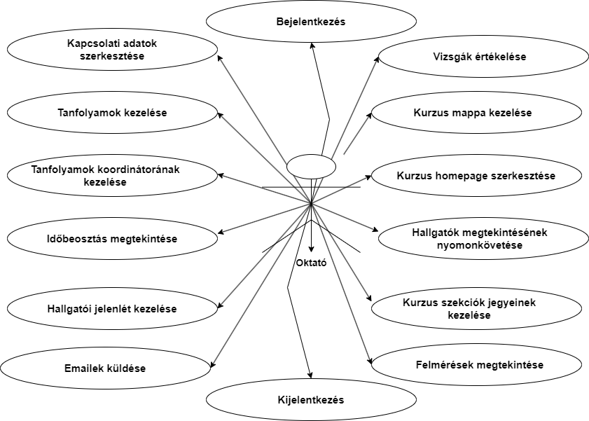
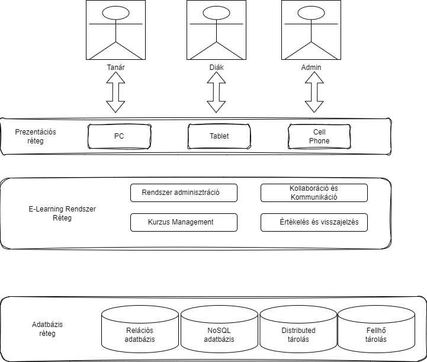
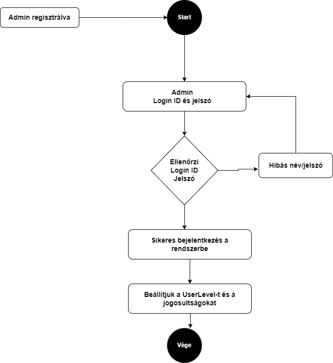
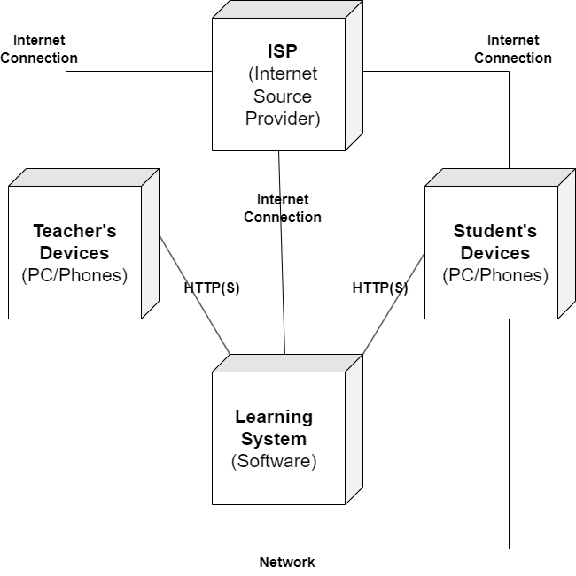

# E-Learning Rendszer Rendszerterve

# E-Learning Kezelőrendszer (LMS) Rendszerterv

## Bevezetés
Az E-Learning Kezelőrendszer (LMS) célja egy hatékony online oktatási platform létrehozása. A rendszer segítségével tanárok könnyen létrehozhatnak, szerkeszthetik és kezelhetik az online kurzusokat, míg a diákok hozzáférhetnek a tartalmakhoz, kvízekhez és feladatokhoz.

### Rendszerkomponensek

#### Felhasználókezelés
A felhasználókezelés komponens a rendszer alapja, amely lehetővé teszi a tanárok és diákok számára a regisztrációt és bejelentkezést a platformon. 

- **Felhasználói fiókok:** Minden felhasználó egyedi felhasználói nevet és jelszót kap. A fiókok segítenek a rendszerben való azonosításban és a jogosultságkezelésben.

- **Profiladatok kezelése:** A tanárok és diákok személyes profiladataikat kezelhetik, például nevüket, képüket és elérhetőségi adataikat.

#### Kurzuskezelés
A kurzuskezelés komponens a tanárok számára lehetőséget biztosít a kurzusok létrehozására, szerkesztésére és tematizálására.

- **Kurzusok létrehozása:** Tanárok könnyen új kurzusokat hozhatnak létre a rendszerben. Azokat tematizálhatják és a kurzusok tartalmait feltölthetik.

- **Tartalomkezelés:** A kurzusokhoz leckéket, videókat, PDF fájlokat és egyéb interaktív anyagokat csatolhatnak.

#### Tartalomkezelés
A tartalomkezelés komponens lehetővé teszi a tanároknak a kurzusokhoz tartozó tartalmak kezelését és a diákok számára tartalmak megjelenítését.

- **Tartalmak feltöltése:** A tanárok könnyen feltölthetik a kurzusokhoz tartozó tartalmakat. Az anyagok bármilyen formátumban lehetnek, például videók, dokumentumok és prezentációk.

- **Automatikus visszajelzés:** A rendszer automatikusan értékeli a diákok kvízekre adott válaszait és feladatokat, majd visszajelzést nyújt az eredményekről.

#### Keresés és Kategorizálás
A keresés és kategorizálás komponens lehetővé teszi a felhasználók számára a kurzusok és tartalmak könnyű megtalálását a rendszerben.

- **Keresési funkció:** Diákok és tanárok használhatják a keresőt a kurzusok és tartalmak gyors megtalálásához.

- **Kategorizálás:** A kurzusok tematikus csoportosítása és kategorizálása segíti a felhasználókat a számukra releváns tartalmak megtalálásában.

#### Bejelentkezés és Biztonság
A bejelentkezés és biztonság komponens felelős a felhasználói adatok védelméért és a jogosultságkezelésért.

- **Felhasználói adatok biztonságos kezelése:** A rendszer gondoskodik a felhasználók adatainak biztonságos tárolásáról, és a jelszavak titkosítva vannak.

- **Bejelentkezési folyamat:** A rendszer egyszerű és biztonságos bejelentkezési folyamatot kínál a felhasználóknak, hogy hozzáférjenek a fiókjukhoz.

### Kapcsolatok a Komponensek Között

A rendszerkomponensek közötti kapcsolatok kulcsfontosságúak a rendszer működése szempontjából.

- A felhasználói fiókok szükségesek a kurzusokhoz való hozzáféréshez és a tartalmak megtekintéséhez.
- A kurzusok tartalmazhatnak leckéket, videókat és kvízeket, amelyeket a tanárok kezelnek.
- A tartalomkezelés és az automatikus visszajelzés szorosan kapcsolódik a kurzusokhoz.
- A keresés és kategorizálás funkciók segítik a felhasználókat a kívánt tartalmak megtalálásában.

### Fejlesztési Ütemterv

A fejlesztési ütemterv a rendszer funkcióinak és komponenseinek lépésről lépésre történő kifejlesztését és integrációját írja le részletesen. Fontos megérteni, hogy a fejlesztési ütemterv időben rugalmas lehet, és az aktuális projektkörülményekhez igazítható.

#### Lépés 1: Felhasználókezelés és Bejelentkezés implementálása
Az első lépésben a felhasználókezelést és bejelentkezés funkciókat hozzuk létre.

- **Felhasználói fiókok:** Ebben a szakaszban a felhasználók regisztrációs és belépési folyamatainak megtervezése és implementáslása történik.

- **Profilkezelés:** A felhasználók profiladatainak kezelését és módosítását teszi lehetővé a rendszer.

#### Lépés 2: Kurzuskezelés és Tartalomkezelés Rendszerének Kifejlesztése
A második lépésben a kurzuskezelés és tartalomkezelés rendszerét hozzuk létre.

- **Kurzusok létrehozása:** Ebben a szakaszban lehetővé tesszük a tanároknak, hogy új kurzusokat hozzanak létre, valamint azokhoz leckéket csatoljanak és tematizálják azokat.

- **Tartalomfeltöltés:** At interaktív tartalomfeltöltés és kezelés kialakítása, beleértve a videókat, egyéb dokumentumokat illetve kvízeket.

#### Lépés 3: Keresés és Kategorizálás Funkciók Hozzáadása
Harmadik lépésben a rendszer keresési és kategorizálási funkcióit hozzuk létre.

- **Keresési funkció:** Az egyszerű és hatékony keresőrendszer implementálása a kurzusok valamint egyéb tartalmak megtalálásához.

- **Kategorizálás és Tematizálás:** A kurzusok tematikus csoportosításának és kategorizálásának lehetővé tétele.

#### Lépés 4: Rendszerbiztonság és Jogosultságkezelés Implementálása
A negyedik lépésben a rendszerbiztonságot és a jogosultságkezelést helyezzük előtérbe.

- **Adatvédelem és Biztonság:** Az adatok biztonságos tárolásának és védelmének biztosítása, beleértve a felhasználói adatokat.

- **Jogosultságkezelés:** A rendszer biztosítja, hogy minden felhasználó csak a megfelelő hozzáférésekkel rendelkező tartalmakhoz férjen hozzá.

#### Lépés 5: Tesztelés és Hibajavítás
Az ötödik lépésben a rendszer teljes körű tesztelésen megy keresztül, és a felmerülő hibákat javítjuk.

- **Tesztelés:** Funkcionális és felhasználói tesztek végrehajtása a rendszer működésének ellenőrzésére.

- **Hibajavítás:** A tesztek során felfedezett hibák és hiányosságok kijavítása.

#### Lépés 6: Felhasználói Visszajelzések Alapján Finomhangolás és Fejlesztések
A hatodik lépésben a felhasználói visszajelzések alapján finomhangoljuk a rendszert és végzünk további fejlesztéseket.

- **Felhasználói Visszajelzések Gyűjtése:** A rendszer aktív használata után a felhasználói visszajelzések összegyűjtése és elemzése.

- **Finomhangolás és Fejlesztések:** Az észrevett igények és problémák alapján a rendszer további finomhangolása és fejlesztése.

A fejlesztési ütemterv rugalmas és az aktuális projekt szükségleteihez igazítható. Az időzítés és az egyes lépések prioritása a projekt méretétől és az elvárásoktól függően változhat. A cél az, hogy egy rugalmas, hatékony és felhasználóbarát LMS rendszert hozzunk létre, amely a tanárok és diákok igényeinek megfelel.

### Következtetés
Az E-Learning Kezelőrendszer (LMS) rendszerterve részletesen bemutatja a rendszer fő komponenseit és azok működését. A tervezési dokumentum segít az építőknek és fejlesztőknek a rendszer hatékony megvalósításában és fejlesztésében.

Az LMS rendszerek napjainkban kulcsfontosságú szerepet játszanak az oktatásban és tanulásban. Az általunk tervezett rendszer lehetővé teszi tanárok és diákok számára a hatékony és interaktív oktatást, függetlenül attól, hogy hol találják magukat a világon. A következő néhány pont alapján összefoglaljuk a rendszer fő előnyeit és potenciális hatásait:

- **Hozzáférhetőség és Rugalmasság:** Az LMS lehetővé teszi a tanárok és diákok számára a bármikor, bárhol történő hozzáférést az oktatási tartalmakhoz. Ez a rendszer különösen hasznos lehet a távoktatásban, az online kurzusok és a tanulás támogatásában.

- **Hatékony Tartalomkezelés:** A rendszer lehetővé teszi a tanároknak a tartalmak egyszerű feltöltését és kezelését, beleértve a videókat, PDF fájlokat és egyéb interaktív anyagokat.

- **Felhasználói Visszajelzések:** Az automatikus visszajelzés funkció segít a tanároknak és diákoknak az oktatási teljesítmény értékelésében és a fejlődésben.

- **Könnyű Navigáció:** Az egyszerű és felhasználóbarát felület segít a tanároknak és diákoknak az eligazodásban a rendszeren belül.

- **Biztonság és Jogosultságkezelés:** A felhasználói adatok biztonságos kezelése és a jogosultságkezelés kulcsfontosságúak a rendszer biztonságához.

Az LMS rendszerrel a tanárok új oktatási lehetőségeket fedezhetnek fel, míg a diákok interaktív módon tanulhatnak. Ez a rendszer lehetővé teszi az oktatás demokratizálását és az oktatáshoz való hozzáférést, ami hozzájárulhat a tudás terjedéséhez és a személyes fejlődéshez.

A jövőben további finomhangolásokra és fejlesztésekre lehet szükség az LMS rendszerben, amelyek a felhasználói visszajelzések és az oktatási igények figyelembevételével alakulnak ki. Az LMS rendszerünk hozzájárulhat a modern oktatás és tanulás fejlődéséhez és előmozdításához, és lehetőséget teremthet a tudás megosztására a világ minden táján.

## Átláthatóság

1. Az ELS-nek biztosítania kell az interoperabilitást, amely kihasználja az ELS alaprendszer egyedi munkavállaló azonosítóját (UEID) annak érdekében, hogy nyomon követhesse egy hallgatót az ELS rendszerben és az adatcserék során.
2. A hallgató és munkavállaló kifejezéseket egymás helyett használhatjuk ebben az IFB/SOW-dokumentumban.
3. Az ELS rendszernek hívnia kell API-kat és/vagy küldenie kell lapos fájlokat a minisztérium ügynökségi kódjával és az azonosított ELS termék nevével.
4. A rendszernek kivételjelentést kell generálnia, amikor egy hallgató információja nem kerül megfelelően feltöltésre.
5. A rendszernek batch feltöltéseket kell fogadnia az adatokra.
6. A rendszernek kapcsolatba kell hoznia és nyomon kell követnie egy hallgatót és az összes kapcsolódó adatot, amelyeket az ELS alaprendszerből az UEID felhasználásával importál.
7. A rendszernek naponta legalább egyszer köteles importálni az ELS alaprendszer munkavállalói és/vagy képzési információkat REST API-n keresztül és/vagy sFTP lapos fájl segítségével.
8. A rendszernek képesnek kell lennie REST API híváskor az ELS termék és az ügynökségi kód használatára, illetve az ELS termék és ügynökségi kód azonosítására egy lapos fájlban az adatcserék során.
9. A rendszernek képesnek kell lennie az azonosításra REST API híváskor.

## Követelmények

1. A rendszernek képesnek kell lennie az LMS alaprendszer rekordjainak importálására az összes olyan munkavállaló számára, akik változtak az utolsó ECR REST API adatforrás és/vagy lapos fájl óta egy adott ügynökségi kódhoz.
2. A rendszernek képesnek kell lennie arra, hogy megállapítsa, egy munkavállaló már nem létezik az ECR REST API adatforrás és/vagy lapos fájl hiányára alapozva, és kikapcsolja azt a munkavállaló rekordot az LMS-ben.
3. A rendszernek frissítenie kell a munkavállalót érintő import folyamaton keresztül (ECR REST API adatforrás és/vagy lapos fájl) az LMS alaprendszerből származó mezőkkel kapcsolatban.
4. A rendszernek nem szabad engedélyeznie a munkavállalói mezők frissítését, amelyeket az ECR alaprendszerből importálnak.
5. A rendszernek képesnek kell lennie diákok képzési információinak exportálására REST API és/vagy lapos fájl exportok segítségével. Csak azokat a rekordokat kell tartalmaznia, amelyek az utolsó adatcserét követően újra kerültek, vagy módosultak vagy töröltek. Ezt naponta legalább egyszer kell végrehajtani.
6. A rendszernek a LMS termék és az ügyfél minisztériumának Agency Code-jával történő API hívás vagy egy lapos fájl exportja segítségével kell importálnia az adatelemeket az LMS alaprendszerből.
7. A rendszernek a LMS termék, az ügynökségi kód és az LMS alaprendszer UEID-jével történő REST API hívás segítségével kell adatokat importálnia egy munkavállaló képzési előzményeiről.
8. A rendszernek egyedi kurzus számokkal kell rendelkeznie.
9. A rendszernek egyedi azonosítóval kell ellátnia egy sorozathoz tartozó kurzusokat.
10. A rendszernek képesnek kell lennie követni egy kurzus iránti érdeklődést az LMS alaprendszer UEID-jével.
11. A rendszernek importálnia kell az LMS alaprendszer referencia táblamezőit legördülő listákhoz REST API és/vagy sFTP lapos fájl segítségével legalább naponta egyszer egy diák, sorozat, kurzus és osztály esetében.
12. Az LMS-nek képesnek kell lennie meghatározott katalógus- és eseményvezérelt adatok (például munkavállalók hozzáadása és eltávolítása, képzési osztályok befejezése, képzési szolgáltatók felsorolása) fogyasztására és közzétételére biztonságos REST API segítségével az LMS Core Systembe és onnan.
13. Az LMS-nek képesnek kell lennie meghatározott katalógus- és eseményvezérelt adatok (például munkavállalók hozzáadása és eltávolítása, képzési osztályok befejezése, képzési szolgáltatók felsorolása) tömeges fájlban történő közzétételére és fogyasztására az ECR Rendszer által előírt formátumban.

## Biztonsági előírások

1. A vállalkozónak meg kell felelnie az IFB szerződési feltételeinek, ideértve, de nem kizárólag a Kalifornia Általános Szolgáltatások Minisztériumának Cloud Computing Speciális Rendelkezéseit SaaS és a Kalifornia Állami Közigazgatási Kézikönyvet (SAM) vonatkozó irányelveket.
2. A vállalkozónak legalább NIST 800-171 szabványkövetelményeknek kell megfelelnie ezen LMS megoldás tekintetében.
3. Ezen LMS megoldáshoz kötelező egy nyilvános felhőalapú környezet.

## Elérhetőség

1. A tervezett rendszerleállásnak legalább 24 órával előre kell lennie ütemezve.
2. A rendszernek lehetővé kell tennie az átállást anélkül, hogy zavarná a szolgáltatást.
3. A tervezett rendszerfrissítéseket, javításokat és támogatást zavar nélkül kell végrehajtani.

## Kapacitás

1. A rendszernek képesnek kell lennie az alkalmazott képzési előzményeinek tárolására és visszahívására legfeljebb 5 évig, legfeljebb 48 óra alatt.
2. A rendszernek képesnek kell lennie a kapacitás bővítésére a munkaerővel, ahogy további minisztériumok csatlakoznak.

## Tanulhatóság

1. A rendszernek kontextusfüggő online súgót kell biztosítania.

## Managelhetőség

1. A rendszernek képesnek kell lennie az alábbi fájltípusokban képzési anyagokat fogadni:
   a) Microsoft által támogatott termékekhez tartozó formátumok Word, Excel és PowerPoint számára.
   b) Adobe Acrobat Reader (PDF)
   c) Általános videofájl formátumok (pl. vob, wmv, mp4)
   d) Általános képformátumok (pl. png, jpg, gif)
2. A rendszernek vezetnünk kell egy audit naplót minden felhasználó tranzakciójáról, és képesnek kell lennie a naplózásokról jelentést készíteni.
3. A rendszernek képesnek kell lennie jelentéseket készíteni kérésre, és részletes eredményeket szolgáltatni az import és export tevékenységekről.

## Megbízhatóság

1. A rendszernek követnie és megjelenítenie kell a hallgatói információkat, beleértve az LMS alaprendszer által szolgáltatott UEID-t.
2. A rendszernek vezetnie kell auditnaplókat az összes végrehajtott tranzakcióról az elsődleges adatkészleteken.

## Biztonság

1. A rendszernek képesnek kell lennie harmadik fél hitelesítési módokkal való integrációra, például O-Auth vagy közvetlen használat.
2. A rendszernek fogadnia kell a

## Használhatóság

1. A rendszernek meg kell felelnie a Section 508 és WCAG 2.0, A és AA legújabb követelményeinek. [Section 508](http://www.section508.gov/) 
2. A rendszernek támogatnia kell a mobilitást (például telefonok és tabletek).
3. A rendszernek támogatnia kell az összes jelenlegi verziót és az előzően támogatott verziókat a modern webböngészőkből, beleértve az Internet Explorert, Firefoxt, Chrome-ot és Safarit.
4. A rendszernek támogatnia kell a zárt feliratozást a számítógépes alapú képzéshez.
5. A rendszernek képesnek kell lennie UEID-k importálására és támogatására.
Bejelentkezés (SSO) tokeneket.

